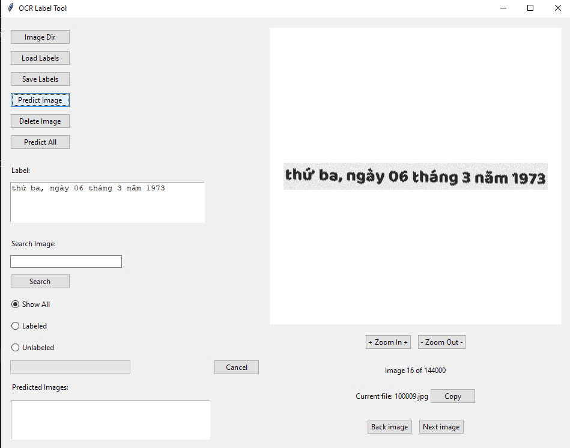
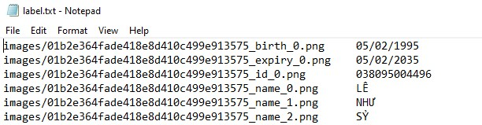

# OCRLabeler

## Giới thiệu

OCRLabeler là một ứng dụng giúp người dùng dễ dàng gán nhãn cho các hình ảnh sử dụng công nghệ nhận dạng ký tự quang học (OCR), tích hợp VietOCR để đưa ra dự đoán.


## Cài đặt
1. **Từ file .exe**
Có thể sử dụng file .exe đã đóng gói tại [đây](https://github.com/ti014/OCRLabeler/releases/download/v1.0.0/OCRLabeler.exe). Nếu bạn muốn tùy chỉnh nâng cao thì theo dõi các bước bên dưới để chạy ứng dụng.
#####
2. **Clone dự án từ GitHub:**

    ```sh
    git clone https://github.com/ti014/OCRLabeler.git
    cd OCRLabeler
    ```

2. **Cài đặt các thư viện cần thiết:**

    Sử dụng `pip` để cài đặt các thư viện từ file [requirements.txt](./requirements.txt):

    ```sh
    pip install -r requirements.txt
    ```

## Sử dụng
1. **Chạy ứng dụng:**

    Chạy file [main.py](./main.py) để khởi động ứng dụng:

    ```sh
    python main.py
    ```

2. **Giao diện người dùng:**

    - **Chọn thư mục hình ảnh:** Nhấn nút "Image Dir" để chọn thư mục chứa các hình ảnh cần gán nhãn.
    - **Tải nhãn:** Nhấn nút "Load Labels" để tải các nhãn từ file.
    - **Lưu nhãn:** Nhấn nút "Save Labels" để lưu các nhãn vào file.
    - **Dự đoán nhãn:** Nhấn nút "Predict Image" để dự đoán nhãn cho hình ảnh hiện tại.
    - **Xóa hình ảnh:** Nhấn nút "Delete Image" để xóa hình ảnh hiện tại.
    - **Dự đoán tất cả:** Nhấn nút "Predict All" để dự đoán nhãn cho tất cả các hình ảnh trong thư mục.
## Demo
- Phần giao diện:

#####
- Nhãn sau khi save sẽ nằm cùng thư mục ảnh và có cấu trúc sau:


## Cấu hình

File cấu hình [app_config.py](./config/app_config.py) chứa các thông tin cấu hình cho mô hình OCR và đường dẫn tới các file trọng số và cấu hình.

## Đóng gói ứng dụng

Sử dụng `PyInstaller` để đóng gói ứng dụng thành file thực thi:

```sh
pyinstaller main.spec
```
Phần này bạn nên tự tìm hiểu cách tạo ra file`main.spec` hoặc đơn giản nhất là sử dụng thư viện [auto-py-to-exe - PyPI](https://pypi.org/project/auto-py-to-exe/)
## Model Weights

Bạn có thể tải file trọng số của mô hình tại [đây](https://github.com/ti014/OCRLabeler/releases/download/v1.0/vgg_transformer.zip).
